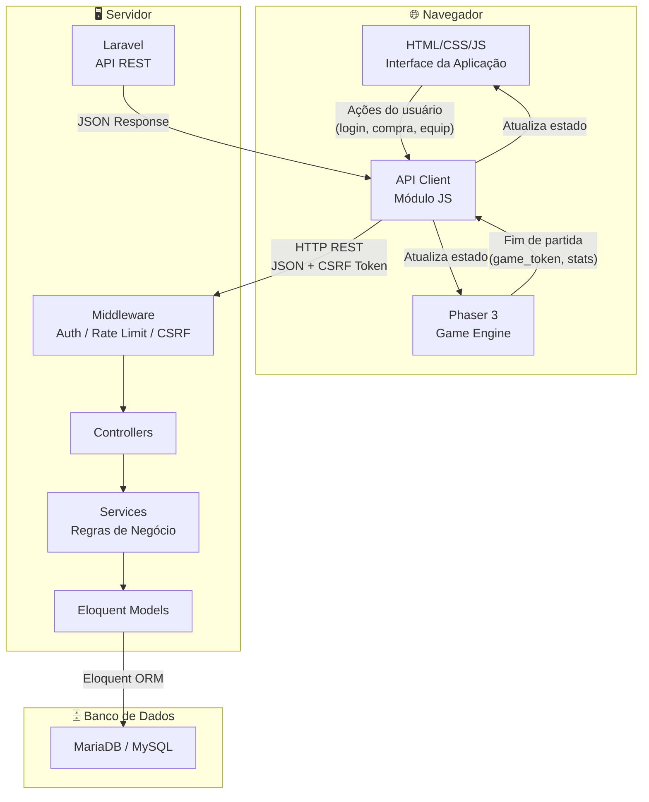
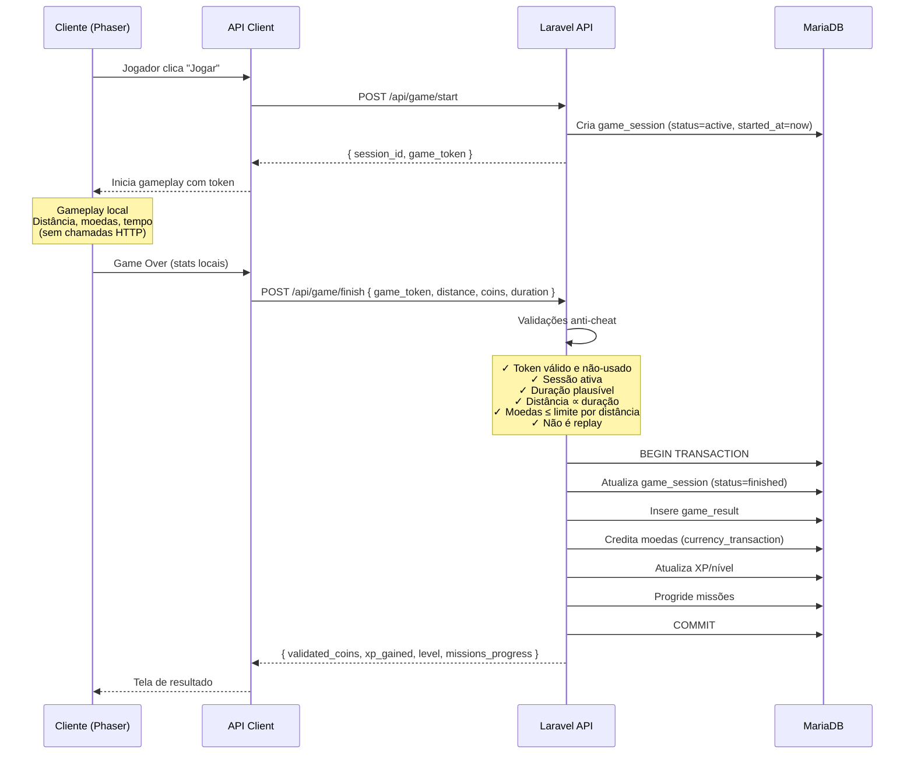

# 🦕 DINOMIC — Relatório de Planejamento Técnico

---

## 1. Diagnóstico — O Que Já Existe

| Item | Status |
|---|---|
| Repositório Git | ✅ Inicializado (1 commit) |
| Licença | ✅ MIT — Copyright 2026 Gabriel Alves Krull |
| `.gitattributes` | ✅ Normalização de line endings (`* text=auto`) |
| `system_instructions.md` | ✅ Documento de requisitos completo (945 linhas) |
| Código fonte (frontend) | ❌ Nenhum |
| Código fonte (backend) | ❌ Nenhum |
| Assets (sprites, imagens, áudio) | ❌ Nenhum fornecido |
| Configuração de ambiente | ❌ Nenhum `.env`, `composer.json`, `package.json` |
| Dependências instaladas | ❌ Nenhuma |
| Banco de dados | ❌ Nenhum schema definido |
| Testes | ❌ Nenhum |
| README | ❌ Não existe |

> [!IMPORTANT]
> O projeto parte **completamente do zero**. Não há código, assets ou configuração pré-existente. Toda a arquitetura será construída de forma planejada, sem legado para manter.

### Sobre Assets

O `system_instructions.md` menciona que "os arquivos do projeto **poderão** conter imagens das skins dos personagens". Nenhum asset foi fornecido até o momento. 

**Decisão:** Estruturarei o sistema de skins e assets com um pipeline de carregamento flexível. Quando os assets reais forem fornecidos, serão integrados sem reestruturação. Para o desenvolvimento inicial, utilizarei **placeholders geométricos simples** (retângulos coloridos no canvas do Phaser) que serão substituídos assim que os sprites reais estiverem disponíveis. Nenhuma imagem falsa será gerada.

---

## 2. Arquitetura Proposta

### Visão Geral da Comunicação



### Fluxo de uma Partida (Anti-Cheat)



### Princípios Arquiteturais

| Princípio | Aplicação |
|---|---|
| **Servidor é a autoridade** | Saldo, inventário, XP, ranking — tudo determinado pelo backend |
| **Cliente é apresentação** | Frontend exibe e coleta input; nunca decide sobre economia |
| **Gameplay é offline** | O loop do Phaser não depende da API; funciona sem rede durante a partida |
| **Transações atômicas** | Operações financeiras usam DB transactions |
| **Idempotência** | Cada `game_token` é de uso único; replay é impossível |
| **Validação dupla** | Frontend valida para UX; backend valida para segurança |

---

## 3. Modelo de Dados Inicial

### Diagrama ER

```mermaid
erDiagram
    users ||--o{ user_skins : "possui"
    users ||--o{ currency_transactions : "registra"
    users ||--o{ game_sessions : "joga"
    users ||--o{ user_missions : "progride"
    users ||--o{ user_achievements : "desbloqueia"
    
    skins ||--o{ user_skins : "comprada por"
    game_sessions ||--o| game_results : "gera"
    missions ||--o{ user_missions : "atribuída a"
    achievements ||--o{ user_achievements : "concedida a"

    users {
        bigint id PK
        string username UK
        string email UK
        string password
        int coins "default 0"
        int xp "default 0"
        int level "default 1"
        bigint equipped_skin_id FK "nullable"
        timestamp last_login_at "nullable"
        timestamps created_at
        timestamps updated_at
    }

    skins {
        bigint id PK
        string slug UK
        string name
        string description "nullable"
        int price
        enum rarity "common,uncommon,rare,epic,legendary"
        string asset_path
        boolean is_available "default true"
        boolean is_default "default false"
        int sort_order "default 0"
        timestamps created_at
        timestamps updated_at
    }

    user_skins {
        bigint id PK
        bigint user_id FK
        bigint skin_id FK
        timestamp acquired_at
        unique user_id_skin_id
    }

    currency_transactions {
        bigint id PK
        bigint user_id FK
        int amount "positivo ou negativo"
        int balance_after
        enum type "game_reward,purchase,refund,admin,mission_reward,achievement_reward"
        string reference_type "nullable, polymorphic"
        bigint reference_id "nullable, polymorphic"
        string description "nullable"
        timestamps created_at
    }

    game_sessions {
        bigint id PK
        bigint user_id FK
        string game_token UK "UUID v4"
        enum status "active,finished,abandoned,flagged"
        timestamp started_at
        timestamp finished_at "nullable"
        timestamps created_at
        timestamps updated_at
    }

    game_results {
        bigint id PK
        bigint game_session_id FK UK
        bigint user_id FK
        int distance
        int coins_collected
        int score
        int duration_seconds
        boolean is_suspicious "default false"
        string suspicion_reason "nullable"
        json metadata "nullable"
        timestamps created_at
    }

    missions {
        bigint id PK
        string slug UK
        string name
        string description
        enum type "daily,weekly"
        string objective_type "distance,coins,jumps,games_played"
        int objective_value
        int reward_coins "default 0"
        int reward_xp "default 0"
        boolean is_active "default true"
        timestamps created_at
        timestamps updated_at
    }

    user_missions {
        bigint id PK
        bigint user_id FK
        bigint mission_id FK
        int current_progress "default 0"
        boolean is_completed "default false"
        timestamp completed_at "nullable"
        boolean is_reward_claimed "default false"
        date assigned_date
        timestamps created_at
        timestamps updated_at
    }

    achievements {
        bigint id PK
        string slug UK
        string name
        string description
        string objective_type "total_distance,total_coins,max_distance,level,games_played"
        int objective_value
        int reward_coins "default 0"
        int reward_xp "default 0"
        string icon "nullable"
        timestamps created_at
        timestamps updated_at
    }

    user_achievements {
        bigint id PK
        bigint user_id FK
        bigint achievement_id FK
        timestamp unlocked_at
        boolean is_reward_claimed "default false"
        unique user_id_achievement_id
    }
```

### Índices Planejados

| Tabela | Índice | Justificativa |
|---|---|---|
| `users` | `email` (unique) | Login por email |
| `users` | `username` (unique) | Exibição no ranking |
| `game_sessions` | `game_token` (unique) | Lookup rápido anti-cheat |
| `game_sessions` | `user_id, status` | Verificar sessão ativa |
| `game_results` | `user_id, score DESC` | Ranking pessoal |
| `game_results` | `score DESC, created_at` | Ranking global |
| `game_results` | `is_suspicious` | Filtrar suspeitos do ranking |
| `user_skins` | `user_id, skin_id` (unique) | Prevenir duplicata |
| `user_missions` | `user_id, assigned_date` | Missões diárias do jogador |
| `user_achievements` | `user_id, achievement_id` (unique) | Prevenir duplicata |
| `currency_transactions` | `user_id, created_at` | Histórico do jogador |

### Curva de Progressão (Valores Centralizados)

Todos os valores de balanceamento serão centralizados em um arquivo de configuração (`config/game.php` no Laravel e `config/game.js` no frontend):

```
Nível    | XP Necessário | XP Acumulado
---------|---------------|-------------
  1 → 2  |          100  |          100
  2 → 3  |          150  |          250
  3 → 4  |          225  |          475
  4 → 5  |          340  |          815
  ...     | floor(anterior * 1.5) | ...
```

**Fórmula:** `xp_para_proximo_nivel = floor(100 * 1.5^(nivel_atual - 1))`

Essa curva geométrica começa acessível e escala suavemente. Pode ser ajustada alterando a base (100) ou o multiplicador (1.5) sem tocar em código.

---

## 4. Estrutura de Diretórios Proposta

```
Dinomic/
├── frontend/                          # Aplicação cliente (servida estaticamente)
│   ├── index.html                     # Entry point
│   ├── css/
│   │   ├── main.css                   # Design system, variáveis, layout global
│   │   ├── components.css             # Botões, cards, modais, badges
│   │   └── responsive.css             # Media queries
│   │
│   ├── js/
│   │   ├── app.js                     # Bootstrap, router SPA simples, init
│   │   │
│   │   ├── api/
│   │   │   └── client.js              # Wrapper HTTP (fetch), interceptors, CSRF
│   │   │
│   │   ├── game/
│   │   │   ├── config.js              # Configuração Phaser, constantes de gameplay
│   │   │   ├── main.js                # Inicialização do Phaser.Game
│   │   │   ├── scenes/
│   │   │   │   ├── BootScene.js       # Preload mínimo, loading bar
│   │   │   │   ├── PreloadScene.js    # Carregamento de todos os assets
│   │   │   │   ├── MenuScene.js       # Menu principal in-game
│   │   │   │   ├── GameScene.js       # Gameplay principal
│   │   │   │   ├── GameOverScene.js   # Resultado, envio ao servidor
│   │   │   │   └── PauseScene.js      # Overlay de pausa
│   │   │   │
│   │   │   ├── entities/
│   │   │   │   ├── Player.js          # Personagem, física, animações
│   │   │   │   ├── Obstacle.js        # Obstáculos (tipos variados)
│   │   │   │   ├── Coin.js            # Moeda coletável
│   │   │   │   └── PowerUp.js         # Power-ups (futuro)
│   │   │   │
│   │   │   ├── systems/
│   │   │   │   ├── SpawnSystem.js     # Geração procedural com safety rules
│   │   │   │   ├── DifficultySystem.js # Curva de dificuldade
│   │   │   │   ├── ScoreSystem.js     # Distância, pontuação
│   │   │   │   └── CoinSystem.js      # Spawn e coleta de moedas
│   │   │   │
│   │   │   ├── managers/
│   │   │   │   ├── AudioManager.js    # Música, SFX, volume, mute
│   │   │   │   ├── InputManager.js    # Teclado + touch unificados
│   │   │   │   └── PoolManager.js     # Object pooling
│   │   │   │
│   │   │   └── utils/
│   │   │       └── helpers.js         # Funções utilitárias do game
│   │   │
│   │   ├── ui/
│   │   │   ├── router.js             # Navegação entre telas (SPA hash-based)
│   │   │   ├── auth.js               # Login, cadastro, estado de sessão
│   │   │   ├── shop.js               # Loja de skins
│   │   │   ├── inventory.js          # Inventário e equip
│   │   │   ├── profile.js            # Perfil do jogador
│   │   │   ├── leaderboard.js        # Ranking
│   │   │   ├── missions.js           # Missões e conquistas
│   │   │   ├── settings.js           # Configurações (áudio, etc.)
│   │   │   └── components.js         # Componentes reutilizáveis (modal, toast, loader)
│   │   │
│   │   └── config/
│   │       └── game.js               # Constantes de balanceamento (espelho do servidor)
│   │
│   └── assets/
│       ├── sprites/                   # Spritesheets dos personagens/skins
│       ├── obstacles/                 # Sprites de obstáculos
│       ├── environment/               # Parallax, chão, fundo
│       ├── ui/                        # Ícones, badges, frames da UI
│       ├── audio/
│       │   ├── music/                 # Trilhas
│       │   └── sfx/                   # Efeitos sonoros
│       └── fonts/                     # Fontes customizadas
│
├── backend/                           # Projeto Laravel
│   ├── app/
│   │   ├── Http/
│   │   │   ├── Controllers/
│   │   │   │   ├── AuthController.php
│   │   │   │   ├── GameController.php
│   │   │   │   ├── ProfileController.php
│   │   │   │   ├── ShopController.php
│   │   │   │   ├── InventoryController.php
│   │   │   │   ├── MissionController.php
│   │   │   │   ├── AchievementController.php
│   │   │   │   └── LeaderboardController.php
│   │   │   │
│   │   │   ├── Middleware/
│   │   │   │   └── GameRateLimiter.php
│   │   │   │
│   │   │   └── Requests/             # Form Requests (validação)
│   │   │       ├── LoginRequest.php
│   │   │       ├── RegisterRequest.php
│   │   │       ├── GameFinishRequest.php
│   │   │       └── PurchaseSkinRequest.php
│   │   │
│   │   ├── Models/
│   │   │   ├── User.php
│   │   │   ├── Skin.php
│   │   │   ├── UserSkin.php
│   │   │   ├── CurrencyTransaction.php
│   │   │   ├── GameSession.php
│   │   │   ├── GameResult.php
│   │   │   ├── Mission.php
│   │   │   ├── UserMission.php
│   │   │   ├── Achievement.php
│   │   │   └── UserAchievement.php
│   │   │
│   │   ├── Services/                 # Regras de negócio isoladas
│   │   │   ├── GameService.php       # Start/finish partida, anti-cheat
│   │   │   ├── EconomyService.php    # Transações, saldo, compras
│   │   │   ├── ProgressionService.php # XP, níveis, missões
│   │   │   └── LeaderboardService.php # Cálculo de ranking
│   │   │
│   │   ├── Policies/                  # Autorização
│   │   │   └── SkinPolicy.php
│   │   │
│   │   └── Events/                    # Eventos de domínio
│   │       ├── GameFinished.php
│   │       └── SkinPurchased.php
│   │
│   ├── config/
│   │   └── game.php                   # Constantes de balanceamento centralizadas
│   │
│   ├── database/
│   │   ├── migrations/
│   │   └── seeders/
│   │       ├── SkinSeeder.php
│   │       ├── MissionSeeder.php
│   │       └── AchievementSeeder.php
│   │
│   ├── routes/
│   │   └── api.php
│   │
│   ├── tests/
│   │   └── Feature/
│   │       ├── AuthTest.php
│   │       ├── GameFlowTest.php
│   │       ├── ShopTest.php
│   │       └── AntiCheatTest.php
│   │
│   ├── .env.example
│   └── ...                            # Demais arquivos padrão do Laravel
│
├── system_instructions.md
├── LICENSE
├── .gitignore
├── .gitattributes
└── README.md
```

### Decisões Estruturais

| Decisão | Justificativa |
|---|---|
| **Frontend como arquivos estáticos (sem bundler)** | A stack pede HTML/CSS/JS puro. Não há requisito para React/Vue/Vite. Phaser 3 pode ser carregado via CDN ou localmente. Simplifica deploy e evita dependências desnecessárias. |
| **SPA hash-based simples** | Navegação entre telas (login, menu, loja) sem recarregar a página. Um router mínimo (~50 linhas) é suficiente. Não justifica um framework SPA inteiro. |
| **Camada `Services` no Laravel** | Controllers ficam finos (recebem request → chamam service → retornam response). Regras de negócio ficam testáveis e reutilizáveis nos Services. |
| **`config/game.php` centralizado** | Todos os valores de balanceamento (XP, moedas, limites anti-cheat) em um único lugar. Evita "números mágicos" espalhados pelo código. |

---

## 5. Plano de Implementação

### Fase 0 — Fundação (Scaffolding)
> Sem funcionalidade visível. Apenas a base para construir sobre.

| # | Tarefa | Detalhes |
|---|---|---|
| 0.1 | Inicializar projeto Laravel | `composer create-project laravel/laravel backend` |
| 0.2 | Criar estrutura do frontend | Pastas, `index.html`, CSS base, `app.js` |
| 0.3 | Configurar `.env.example` | Banco, APP_KEY, URLs |
| 0.4 | Configurar `.gitignore` | `vendor/`, `node_modules/`, `.env`, etc. |
| 0.5 | Configurar CORS no Laravel | Para aceitar requests do frontend |
| 0.6 | Criar `config/game.php` | Constantes de balanceamento iniciais |
| 0.7 | Design System CSS | Variáveis, tipografia, cores, componentes base |
| 0.8 | `README.md` inicial | Instruções de setup |

### Fase 1 — Autenticação
> O jogador pode criar conta e entrar.

| # | Tarefa |
|---|---|
| 1.1 | Migrations: `users` |
| 1.2 | Model `User` com Laravel Sanctum (API tokens) |
| 1.3 | `AuthController` (register, login, logout, me) |
| 1.4 | Form Requests + validação |
| 1.5 | Rate limiting nos endpoints de auth |
| 1.6 | Frontend: telas de login/cadastro |
| 1.7 | `api/client.js` com interceptors de auth |
| 1.8 | Testes: AuthTest |

### Fase 2 — Gameplay Core
> O jogo roda no navegador. Sem integração com servidor ainda.

| # | Tarefa |
|---|---|
| 2.1 | Integrar Phaser 3 |
| 2.2 | `BootScene` + `PreloadScene` (com loading bar) |
| 2.3 | `GameScene` — chão, fundo parallax, personagem correndo |
| 2.4 | `Player` — pular, abaixar, animações (placeholder) |
| 2.5 | `InputManager` — teclado + touch |
| 2.6 | `SpawnSystem` — obstáculos com safety rules |
| 2.7 | `DifficultySystem` — aceleração progressiva |
| 2.8 | `ScoreSystem` — distância, HUD |
| 2.9 | `CoinSystem` — spawn, coleta, contagem local |
| 2.10 | `GameOverScene` — resultado na tela |
| 2.11 | `PauseScene` — ESC / botão |
| 2.12 | `PoolManager` — reciclagem de obstáculos e moedas |
| 2.13 | Responsividade do canvas |
| 2.14 | Controles mobile |

### Fase 3 — Integração Game ↔ Servidor
> O resultado da partida é enviado e validado pelo backend.

| # | Tarefa |
|---|---|
| 3.1 | Migrations: `game_sessions`, `game_results`, `currency_transactions` |
| 3.2 | Models + relacionamentos |
| 3.3 | `GameService` — start (gera token), finish (valida + credita) |
| 3.4 | `GameController` — endpoints start/finish |
| 3.5 | Anti-cheat: validação de duração, distância, moedas |
| 3.6 | `EconomyService` — transações atômicas |
| 3.7 | Frontend: integrar fluxo start→gameplay→finish→resultado |
| 3.8 | Testes: GameFlowTest, AntiCheatTest |

### Fase 4 — Skins, Loja e Inventário
> O jogador pode comprar e equipar skins.

| # | Tarefa |
|---|---|
| 4.1 | Migrations: `skins`, `user_skins` |
| 4.2 | Models + relacionamentos |
| 4.3 | `ShopController`, `InventoryController` |
| 4.4 | `EconomyService` — compra com validação server-side |
| 4.5 | Seeder de skins iniciais |
| 4.6 | Frontend: tela da loja |
| 4.7 | Frontend: tela do inventário |
| 4.8 | Integrar skin equipada no Phaser |
| 4.9 | Testes: ShopTest |

### Fase 5 — Perfil, XP e Progressão
> O jogador vê seu progresso e sobe de nível.

| # | Tarefa |
|---|---|
| 5.1 | `ProgressionService` — cálculo de XP/nível |
| 5.2 | `ProfileController` |
| 5.3 | Frontend: tela de perfil (nível, XP, stats) |
| 5.4 | Barra de XP com animação |

### Fase 6 — Missões e Conquistas
> O jogador tem objetivos para cumprir.

| # | Tarefa |
|---|---|
| 6.1 | Migrations: `missions`, `user_missions`, `achievements`, `user_achievements` |
| 6.2 | Models + relacionamentos |
| 6.3 | `MissionController`, `AchievementController` |
| 6.4 | Lógica de progressão e claim de recompensas |
| 6.5 | Atribuição automática de missões diárias |
| 6.6 | Frontend: tela de missões e conquistas |
| 6.7 | Seeders |

### Fase 7 — Ranking
> Os jogadores competem por posição.

| # | Tarefa |
|---|---|
| 7.1 | `LeaderboardService` — ranking geral com paginação |
| 7.2 | `LeaderboardController` |
| 7.3 | Frontend: tela de ranking |
| 7.4 | Filtro de resultados suspeitos |

### Fase 8 — Áudio
> Trilha sonora e efeitos.

| # | Tarefa |
|---|---|
| 8.1 | `AudioManager` — música, SFX, volume, mute |
| 8.2 | Persistência de preferência (localStorage) |
| 8.3 | Respeitar política de autoplay do navegador |
| 8.4 | Frontend: configurações de áudio |

### Fase 9 — Polimento e Hardening
> Qualidade final antes de considerar "v1".

| # | Tarefa |
|---|---|
| 9.1 | Revisão completa de segurança |
| 9.2 | Revisão de performance (Lighthouse, DevTools) |
| 9.3 | Testes de responsividade em múltiplos dispositivos |
| 9.4 | Acessibilidade (contraste, foco, navegação por teclado) |
| 9.5 | Tratamento de erros (offline, timeout, sessão expirada) |
| 9.6 | README final com instruções completas |
| 9.7 | `.env.example` revisado |
| 9.8 | Documentação de decisões arquiteturais |

---

## 6. Riscos Técnicos

| # | Risco | Probabilidade | Impacto | Mitigação |
|---|---|---|---|---|
| R1 | **Ausência de assets** — sem sprites reais, a experiência visual fica comprometida | Alta | Alto | Desenvolver com placeholders geométricos. O sistema de carregamento será independente dos assets finais. Solicitar assets ao dono do projeto antes da Fase 4. |
| R2 | **Phaser 3 + responsividade** — Phaser não é naturalmente responsivo; resize do canvas pode causar distorções | Média | Médio | Usar `Phaser.Scale.ScaleManager` com `mode: FIT` ou `RESIZE`. Testar em múltiplas resoluções desde a Fase 2. |
| R3 | **Anti-cheat bypassável** — em jogos client-side, é impossível evitar 100% das fraudes | Certa | Médio | Aceitar limitações. Implementar validações razoáveis (duração, limites, idempotência). Marcar suspeitos em vez de bloquear automaticamente. |
| R4 | **Race conditions em transações** — compras simultâneas, double-submit | Baixa | Alto | Usar DB transactions com `SELECT ... FOR UPDATE`. Tokens de uso único. Constraints UNIQUE no banco. |
| R5 | **Escopo excessivo para v1** — o documento lista ~15 sistemas (loja, missões, conquistas, ranking, etc.) | Alta | Alto | Seguir plano faseado. Cada fase é independente e entrega valor. Priorizar gameplay funcional antes de sistemas secundários. |
| R6 | **Performance do ranking em escala** — queries de ordenação podem ficar lentas com muitos registros | Baixa (v1) | Médio | Índices adequados. Paginação. Para escala futura: cache ou tabela materializada de ranking. |
| R7 | **Configuração do ambiente** — PHP/Composer/MariaDB podem não estar instalados na máquina de desenvolvimento | Média | Médio | Documentar requisitos no README. Verificar versões antes da Fase 0. |

---

## 7. Segurança — Ameaças e Medidas

| Ameaça | Vetor | Medida |
|---|---|---|
| **SQL Injection** | Inputs não sanitizados em queries | Eloquent ORM (prepared statements). Nunca concatenar input em queries raw. |
| **XSS** | Dados do usuário renderizados sem escape | Blade escapa por padrão (`{{ }}`). No frontend JS, usar `textContent` em vez de `innerHTML`. Sanitizar nomes de usuário. |
| **CSRF** | Requisições forjadas de outros sites | Laravel CSRF middleware. Para API stateless: Sanctum token-based auth. |
| **Mass Assignment** | Enviar campos extras na request | `$fillable` explícito em todos os Models. Form Requests com validação estrita. |
| **Manipulação de preço** | Frontend envia preço falso na compra | Backend busca preço oficial do banco. Ignora qualquer preço enviado pelo cliente. |
| **Falsificação de pontuação** | Enviar score inventado via API | Token de sessão de uso único. Validar duração, distância, moedas. Marcar suspeitos. |
| **Replay de requisições** | Reenviar request de game/finish | `game_token` UUID de uso único. Sessão marcada como `finished` no primeiro uso. |
| **Brute force login** | Tentar milhares de senhas | Rate limiting: 5 tentativas/minuto por IP. Laravel `ThrottleRequests`. |
| **Compra duplicada** | Clicar comprar N vezes | UNIQUE constraint (`user_id`, `skin_id`). Verificação server-side antes da transação. |
| **Alteração de saldo** | Manipular coins via DevTools | Saldo nunca determinado pelo cliente. Calculado exclusivamente via `currency_transactions`. |
| **Enumeração de usuários** | Testar emails no registro/login | Mensagens genéricas ("credenciais inválidas" para login; rate limit no registro). |
| **Chamadas excessivas à API** | Spam de requests | Rate limiting global + por endpoint. Middleware customizado para endpoints sensíveis. |
| **Acesso não autorizado** | Acessar recursos de outros jogadores | Middleware `auth:sanctum`. Policies: usuário só acessa/modifica seus próprios dados. |
| **Exposição de informações** | Stack traces, SQL errors no response | `APP_DEBUG=false` em produção. Handler de exceções customizado. Logs internos sem expor ao cliente. |

---

## 8. Performance — Pontos de Atenção

| Área | Risco | Medida |
|---|---|---|
| **Game Loop** | Criar/destruir objetos no `update()` gera garbage collection | Object pooling para obstáculos, moedas e partículas. Pré-alocar objetos no `create()`. |
| **Sprites** | Carregamento lento se muitos assets individuais | Usar spritesheets/atlas quando houver assets reais. Preload na `PreloadScene` com barra de progresso. |
| **Requisições HTTP durante gameplay** | Lag ou travamento se API demorar | **Zero requisições HTTP durante o gameplay.** Tudo acontece no `start` (antes) e `finish` (depois). |
| **Ranking queries** | `ORDER BY score DESC` em tabela grande | Índice em `(score DESC, created_at)`. Paginação com cursor ou offset. Limitar a 100 por página. |
| **N+1 queries** | Carregar relações em loop | Eager loading (`with()`) em todas as queries que carregam relacionamentos. |
| **Assets estáticos** | Sem cache = download repetido | Headers de cache (`Cache-Control`, `ETag`). Compressão gzip/brotli no servidor web. |
| **Canvas resize** | Resize event disparado repetidamente | Debounce no evento de resize. `ScaleManager` do Phaser lida nativamente com isso. |
| **Banco de dados** | Muitas transações em pico | Connection pooling. Transações curtas. Evitar locks longos. |

---

## 9. Decisões Técnicas Tomadas

| Decisão | Alternativas Consideradas | Justificativa |
|---|---|---|
| **Laravel Sanctum para auth** | Passport, JWT puro | Sanctum é mais leve e adequado para SPA + API no mesmo domínio. Passport é overkill para este caso. JWT puro requer implementar refresh/revoke manualmente. |
| **Frontend sem bundler** | Vite, Webpack | O requisito é HTML/CSS/JS puro. Bundler adiciona complexidade sem benefício claro para este escopo. ES modules nativos do navegador são suficientes. |
| **Hash-based SPA router** | Full SPA framework, MPA (multi-page) | Router mínimo evita recarregar a página sem adicionar um framework inteiro. Hash routing (`#/shop`, `#/profile`) funciona sem configuração de servidor. |
| **UUID v4 para game_token** | Auto-increment, ULID | UUID é não-previsível (segurança), não-sequencial (anti-enumeração) e globalmente único. |
| **Curva de XP geométrica** | Linear, logarítmica | Geométrica (`100 * 1.5^n`) é o padrão da indústria de jogos — progressão acessível no início, mais lenta no final, sem platô abrupto. |
| **Marcar suspeitos em vez de banir** | Ban automático | Heurísticas anti-cheat podem ter falsos positivos. Marcar e filtrar do ranking é mais seguro que bloquear jogadores legítimos. |

---

## 10. Dúvidas Bloqueantes

> [!NOTE]
> Nenhuma dúvida é **bloqueante** para iniciar a implementação. As decisões abaixo foram tomadas de forma razoável e podem ser ajustadas a qualquer momento.

Porém, há **duas informações relevantes** que influenciam o desenvolvimento:

### 1. Assets do personagem e skins
Você planeja fornecer sprites/spritesheets para o personagem e as skins? Se sim, em qual formato (PNG individual, spritesheet, atlas JSON)?

**Decisão tomada na ausência de resposta:** Desenvolvo com placeholders geométricos e crio o sistema de carregamento preparado para receber sprites reais a qualquer momento.

### 2. Ambiente de desenvolvimento
Você já tem PHP, Composer, MariaDB/MySQL e um servidor web local (como XAMPP, Laragon ou Docker) instalados? Ou prefere que eu configure com Docker Compose?

**Decisão tomada na ausência de resposta:** Documento ambas as opções no README (local e Docker) e sigo com a configuração local padrão do Laravel.

---

> [!TIP]
> **Próximo passo:** Após sua aprovação deste plano, inicio a **Fase 0 (Fundação)** — scaffolding do Laravel, estrutura do frontend, design system CSS e configuração inicial.
